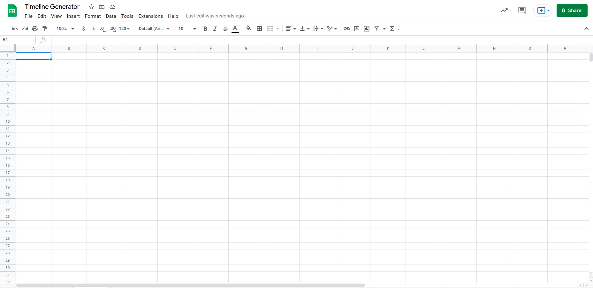
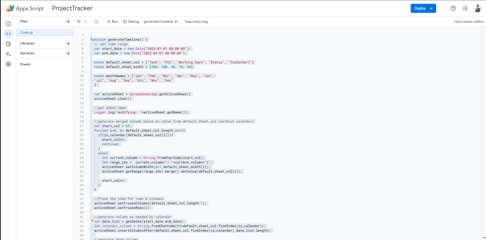
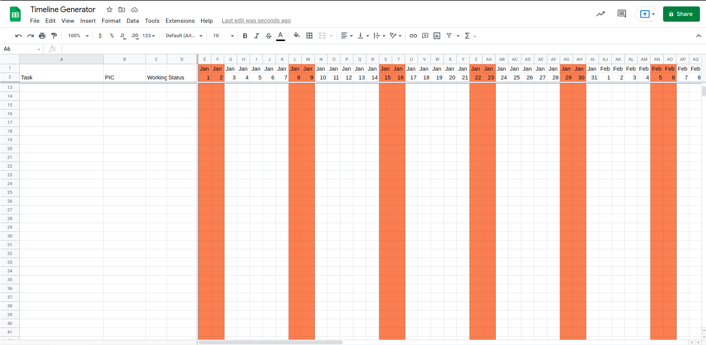

# Timeline Generator

## How To Use
1) Open the spreadsheet that you want to generate the timeline in
2) Make sure to set the view on empty sheet, as it will overwrite the entire sheet
   
3) Click on Extensions > Apps Script 
4) copy and paste the code inside "[generateTimeline.js](https://github.com/ironecally/Gsheet/blob/main/timelineGenerator/generateTimeline.js)"
5) click on "Run"
   
6) Voila
   